# StockKeeper API Flow Diagrams

This document provides comprehensive Mermaid flow diagrams documenting all API operations, including validation, conditional checks, and DynamoDB mutations.

---

## Architecture Context

### AWS Infrastructure & Disaster Recovery

The StockKeeper system is deployed in an **active–passive multi-region AWS architecture**. For the complete infrastructure topology, disaster recovery strategy, and regional failover design, refer to the AWS Architecture Diagram below.

#### Deployment Topology Summary

| Aspect | Primary Region (Active) | Secondary Region (Passive) |
|--------|-------------------------|----------------------------|
| **Traffic** | All read/write operations | No traffic until failover |
| **EKS Services** | Fully scaled, processing requests | Cold standby (scaled to 0) |
| **DynamoDB** | Global Tables (active writes) | Global Tables (read-only replica) |
| **Failover** | — | Promoted via Route 53 health checks |

#### Separation of Concerns

| Diagram Type | Scope | Covers |
|--------------|-------|--------|
| **AWS Architecture Diagram** | Infrastructure layer | Regions, VPCs, EKS, DynamoDB Global Tables, Route 53, DR strategy, failover |
| **Mermaid Flow Diagrams** (this document) | Application layer | API operations, validation logic, state transitions, Policy Engine, DynamoDB mutations |

> **Note:** All Mermaid diagrams in this document represent logical flows executing within the **active (primary) region**. Disaster recovery and cross-region replication are handled at the infrastructure layer and are not repeated in individual operation flows.

---

## 1. System Architecture Overview

*Deployed in an active–passive multi-region AWS architecture; flows shown assume the active (primary) region.*

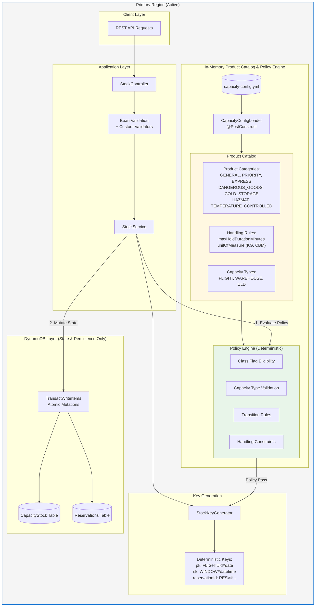

> **Key Insight:** Product rules and policy are enforced in memory before any DynamoDB write. DynamoDB is used only for state persistence, quantity mutations, and idempotency checks.

---

## 2. HOLD Operation Flow

The HOLD operation reserves capacity for a shipment. It uses `TransactWriteItems` with two conditions for atomicity and idempotency.

> **Policy Engine is consulted BEFORE any DynamoDB mutation.** All business rules are enforced in memory.

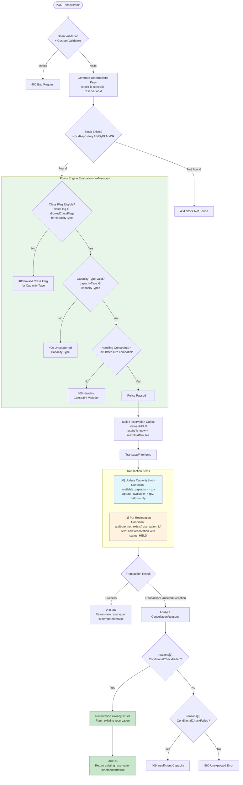

### Key Generation Pattern (HOLD)

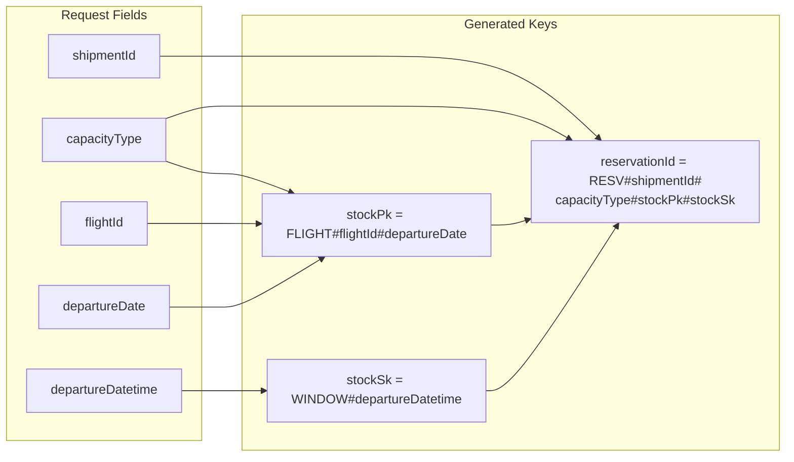

---

## 3. COMMIT Operation Flow

COMMIT transitions a reservation from HELD to COMMITTED, moving capacity from `held_capacity` to `committed_capacity`.

---

## 4. LOAD Operation Flow

LOAD transitions a reservation from COMMITTED to LOADED, moving capacity from `committed_capacity` to `loaded_capacity`.

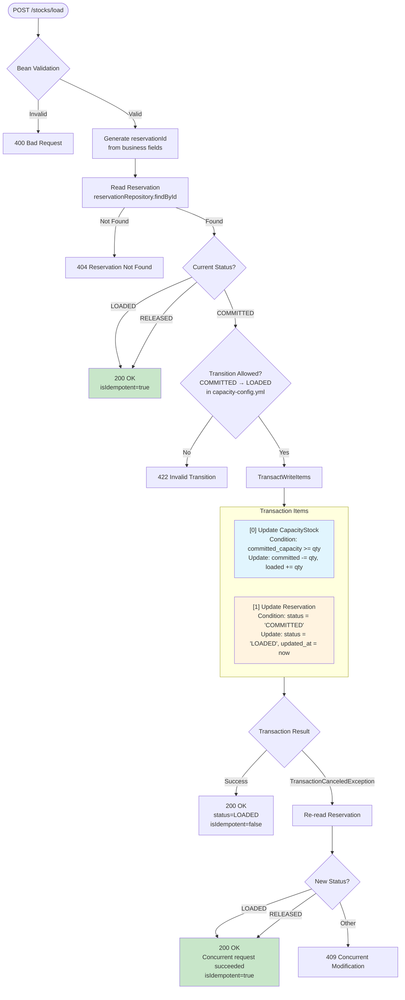

---

## 5. RELEASE Operation Flow

RELEASE can be called from any non-terminal state (HELD, COMMITTED, LOADED). It returns capacity to `available_capacity`.

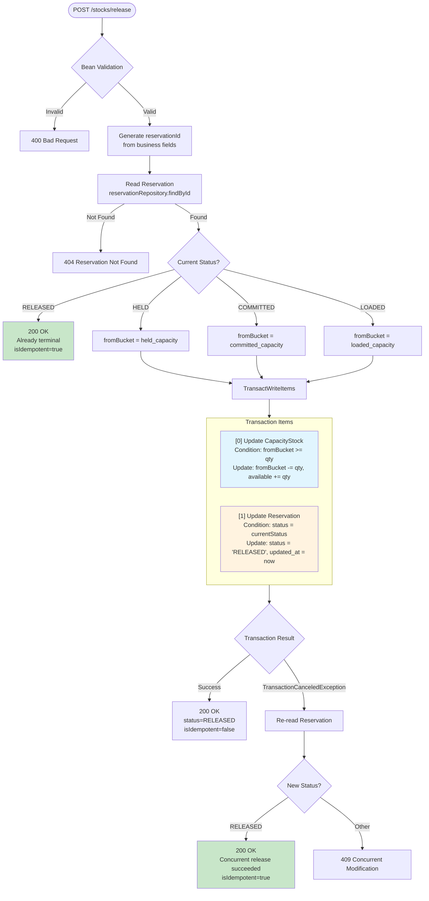

### RELEASE Capacity Movement by Source State

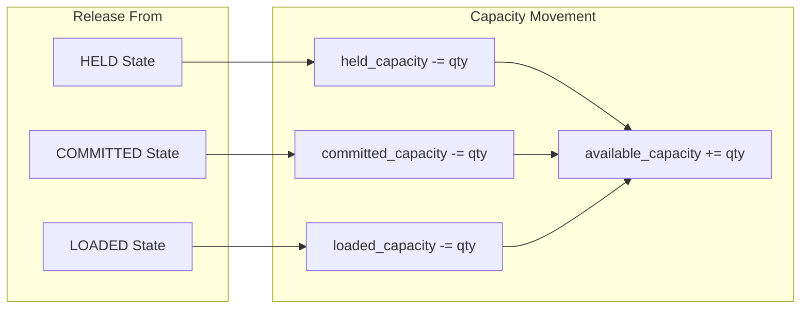

---

## 6. State Machine Diagram

The complete reservation lifecycle with all valid transitions.

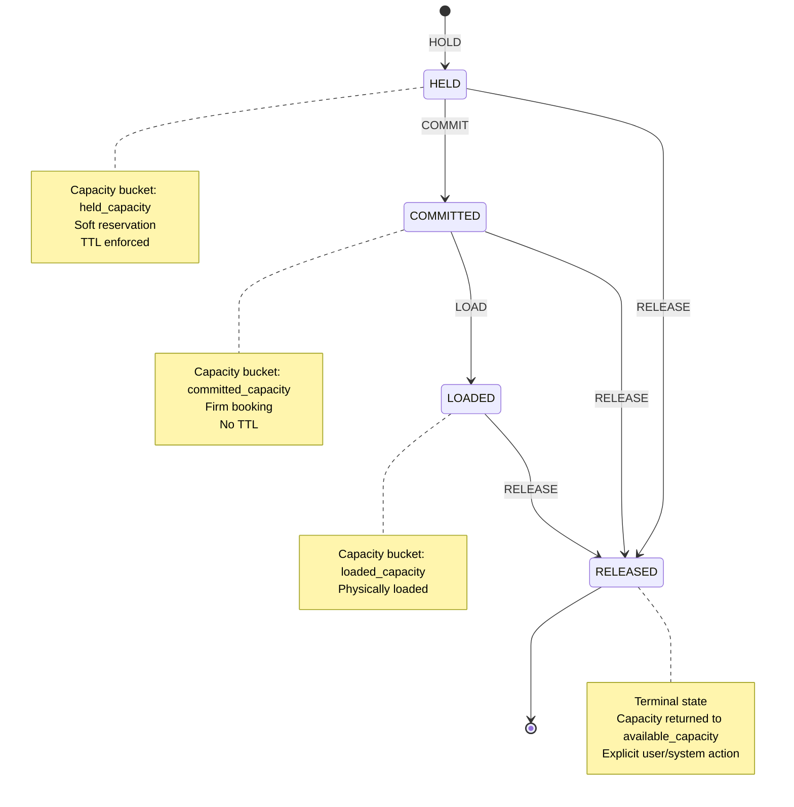

### State Transition Matrix

| From State | Valid Transitions | Capacity Movement |
|------------|-------------------|-------------------|
| HELD | COMMITTED, RELEASED | held → committed, held → available |
| COMMITTED | LOADED, RELEASED | committed → loaded, committed → available |
| LOADED | RELEASED | loaded → available |
| RELEASED | (none - terminal) | - |

---

## 7. Idempotency Handling

### Overview: How Idempotency Works

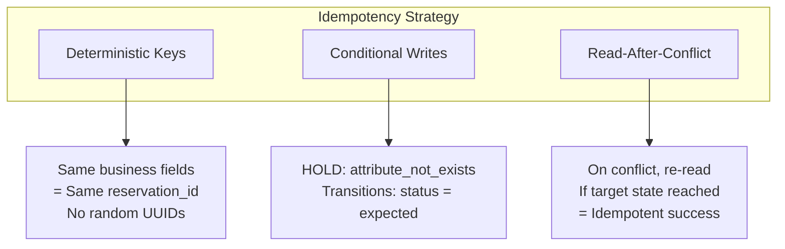

### HOLD Idempotency Flow

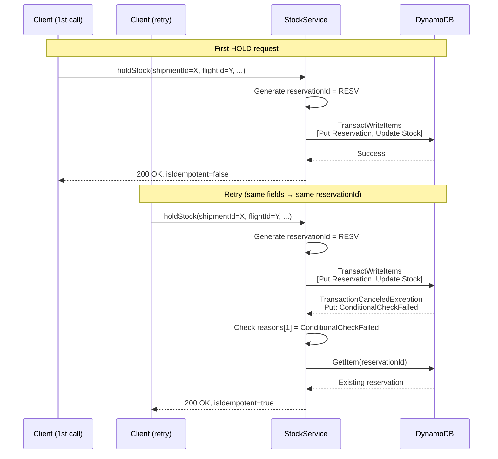

### Transition Idempotency Flow

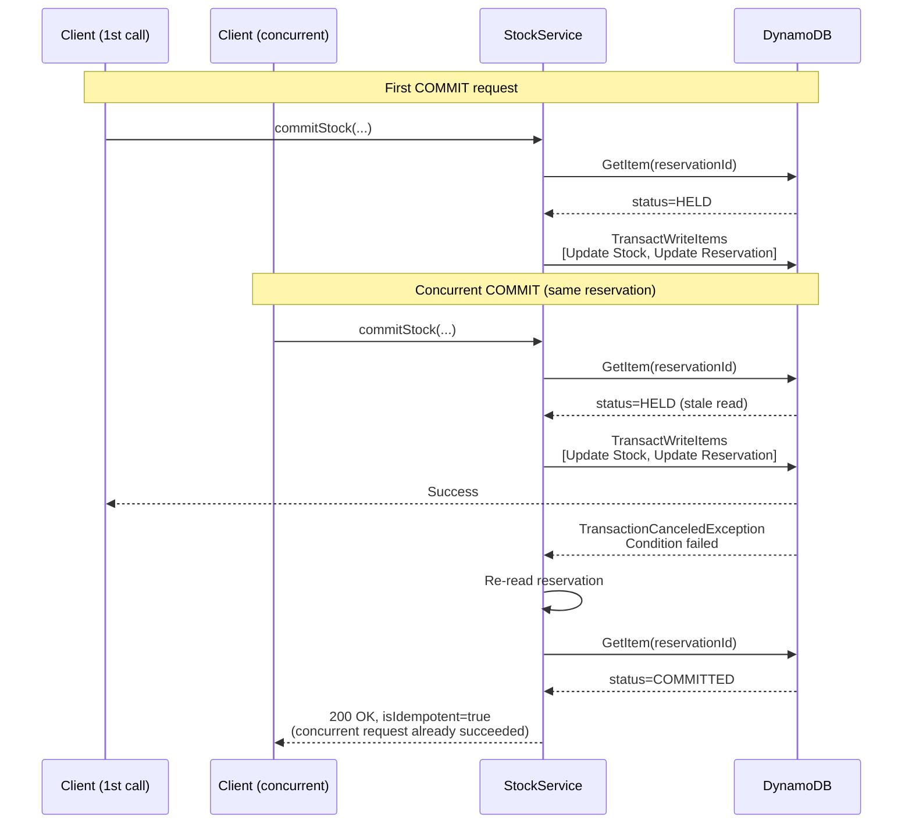

### Idempotency Decision Tree

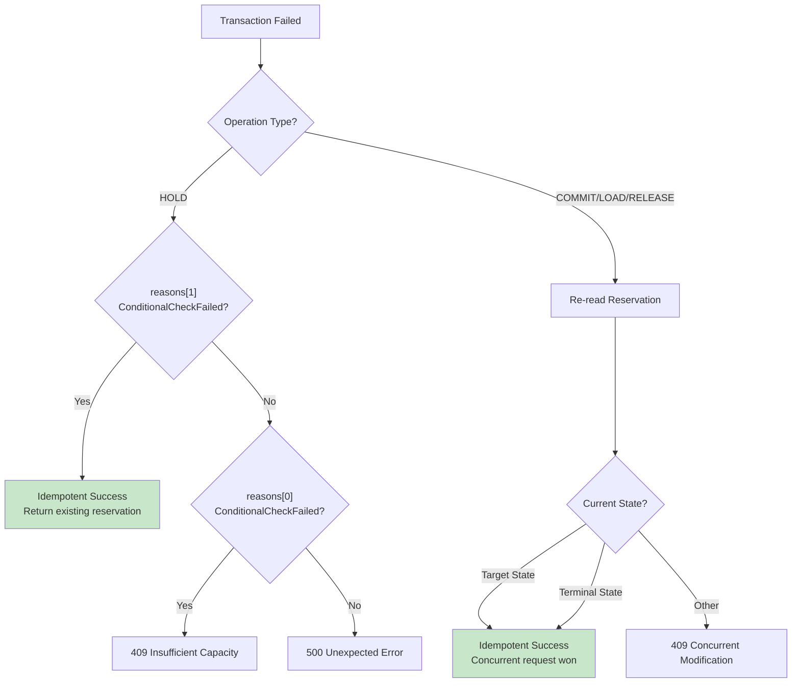

---

## 8. DynamoDB Transaction Patterns

### TransactWriteItems Structure

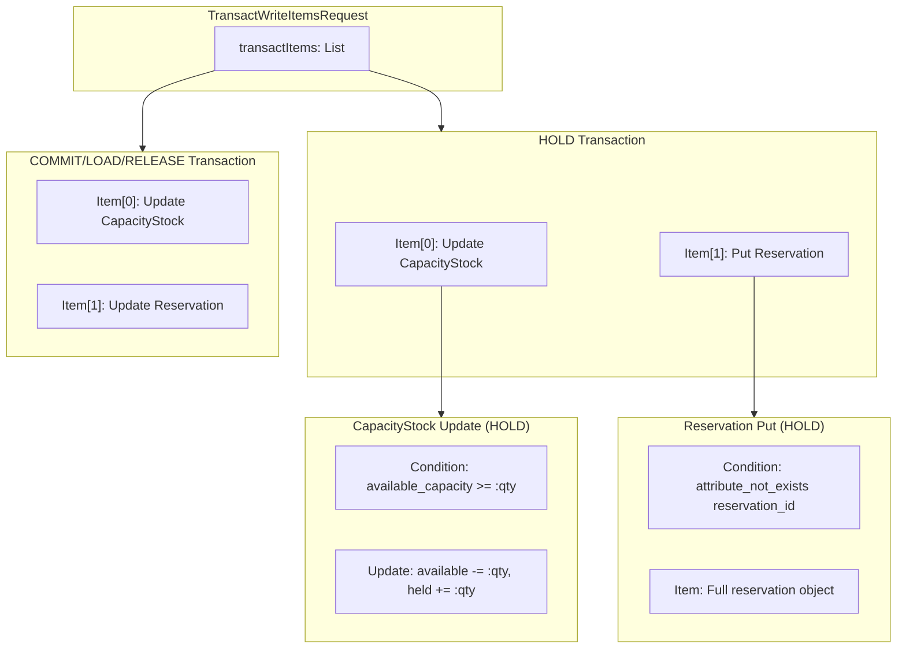

### Condition Expression Patterns

| Operation | Item | Condition | Purpose |
|-----------|------|-----------|---------|
| HOLD | CapacityStock | `available_capacity >= :qty` | Ensure sufficient capacity |
| HOLD | Reservation | `attribute_not_exists(reservation_id)` | Prevent duplicate creates |
| COMMIT | CapacityStock | `held_capacity >= :qty` | Ensure capacity in correct bucket |
| COMMIT | Reservation | `#st = :expected` | Optimistic lock on status |
| LOAD | CapacityStock | `committed_capacity >= :qty` | Ensure capacity in correct bucket |
| LOAD | Reservation | `#st = :expected` | Optimistic lock on status |
| RELEASE | CapacityStock | `<bucket>_capacity >= :qty` | Ensure capacity in source bucket |
| RELEASE | Reservation | `#st = :expected` | Optimistic lock on status |

---

## 9. Configuration-Driven Validation & Product Catalog

The Product Catalog is loaded from `capacity-config.yml` at startup and kept **in memory**. The Policy Engine uses this catalog to enforce all business rules **before** any DynamoDB operation.

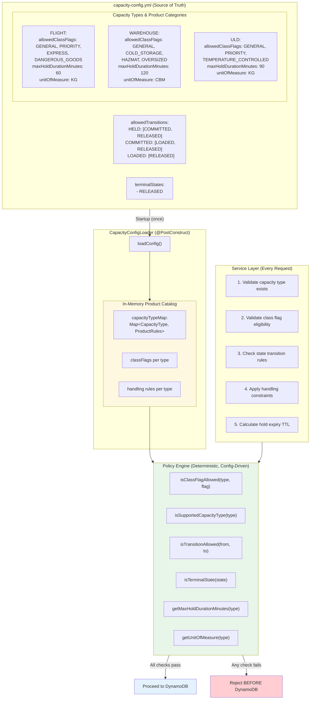

### Product Categories (Class Flags)

| Capacity Type | Allowed Class Flags | Unit | Max Hold |
|---------------|---------------------|------|----------|
| FLIGHT | GENERAL, PRIORITY, EXPRESS, DANGEROUS_GOODS | KG | 60 min |
| WAREHOUSE | GENERAL, COLD_STORAGE, HAZMAT, OVERSIZED | CBM | 120 min |
| ULD | GENERAL, PRIORITY, TEMPERATURE_CONTROLLED | KG | 90 min |

### Policy Engine Rules (All In-Memory)

| Rule | Check | Reject If |
|------|-------|-----------|
| Class Flag Eligibility | `classFlag ∈ type.allowedClassFlags` | Flag not allowed for capacity type |
| Capacity Type | `capacityType ∈ capacityTypes` | Unknown capacity type |
| State Transition | `targetState ∈ allowedTransitions[currentState]` | Invalid transition |
| Terminal State | `state ∈ terminalStates` | Attempting transition from terminal |
| Handling Constraints | Unit of measure compatibility | Incompatible unit |

---

## 10. Product Catalog & Policy Engine Flow

This diagram explicitly shows how the in-memory Product Catalog and Policy Engine are consulted **before** any DynamoDB mutation.

> **Non-Negotiable:** Product rules and policy are enforced in memory before any DynamoDB write. DynamoDB is used ONLY for state persistence, quantity mutations, and idempotency.

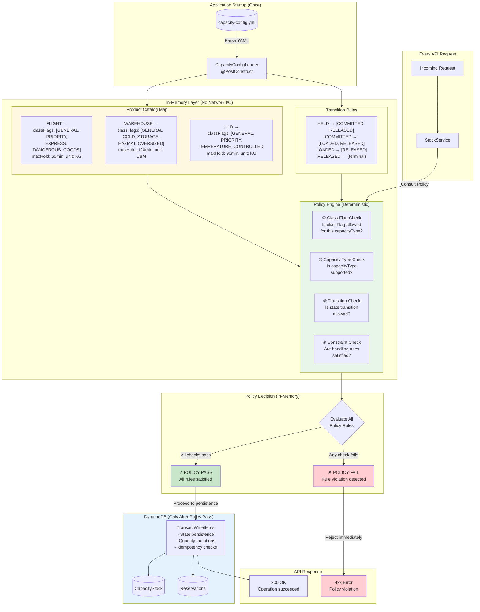

### What Gets Checked Where

| Layer | What It Does | Examples |
|-------|--------------|----------|
| **Product Catalog (In-Memory)** | Stores product rules | Class flags per type, hold durations, units |
| **Policy Engine (In-Memory)** | Enforces business rules | Flag eligibility, transition validity, constraints |
| **DynamoDB** | Persists state, ensures consistency | Atomic writes, capacity math, idempotency |

### Policy Engine Guarantees

1. **No AI/ML** — Purely deterministic, config-driven logic
2. **No Network I/O** — All checks happen in application memory
3. **Fail Fast** — Invalid requests rejected before touching DynamoDB
4. **Single Source of Truth** — All rules derive from `capacity-config.yml`

---

## Quick Reference

### API Endpoints

| Endpoint | Method | Description |
|----------|--------|-------------|
| `/stocks/hold` | POST | Reserve capacity (HELD state) |
| `/stocks/commit` | POST | Confirm reservation (COMMITTED state) |
| `/stocks/load` | POST | Mark as loaded (LOADED state) |
| `/stocks/release` | POST | Release reservation (RELEASED state) |
| `/stocks` | GET | List/query stock items |
| `/stocks/{pk}/{sk}` | GET | Get single stock item |

### Key Patterns

| Entity | Key Pattern | Example |
|--------|-------------|---------|
| Stock PK (FLIGHT) | `FLIGHT#<flightId>#<departureDate>` | `FLIGHT#SQ123#2024-03-15` |
| Stock SK (FLIGHT) | `WINDOW#<departureDatetime>` | `WINDOW#2024-03-15T08:00:00Z` |
| Reservation ID | `RESV#<shipmentId>#<capacityType>#<pk>#<sk>` | `RESV#SHIP001#FLIGHT#...` |

### HTTP Response Codes

| Code | Meaning |
|------|---------|
| 200 | Success (check `isIdempotent` flag) |
| 400 | Validation error |
| 404 | Stock or reservation not found |
| 409 | Insufficient capacity or concurrent modification |
| 422 | Invalid state transition |
