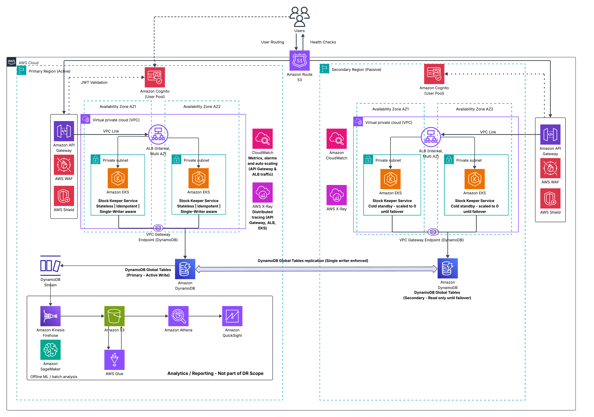
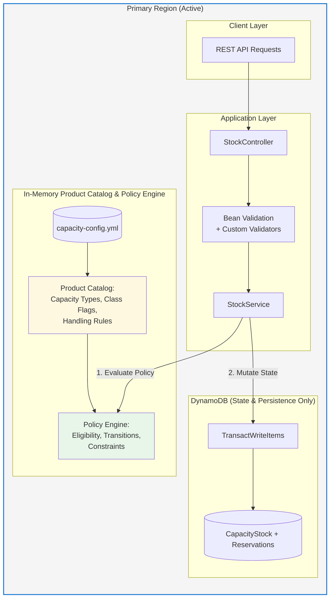
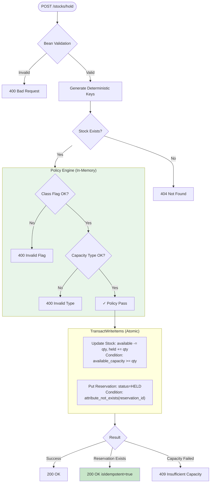
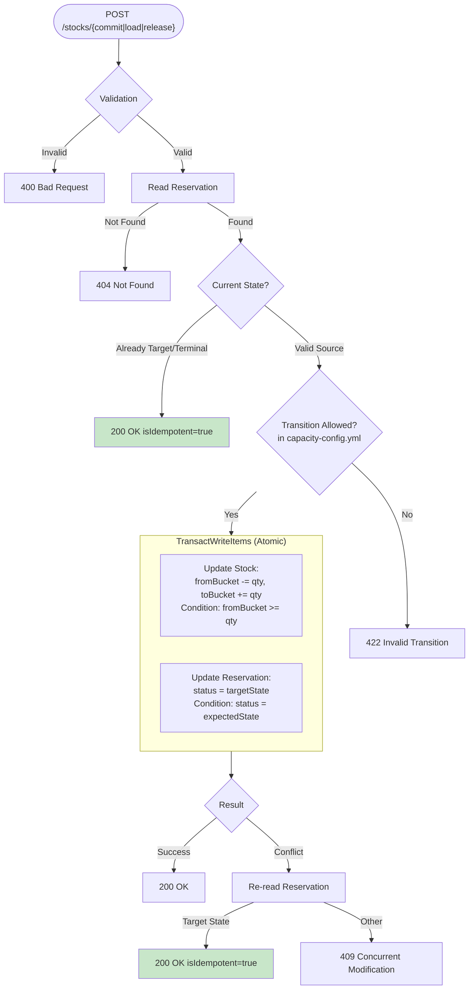
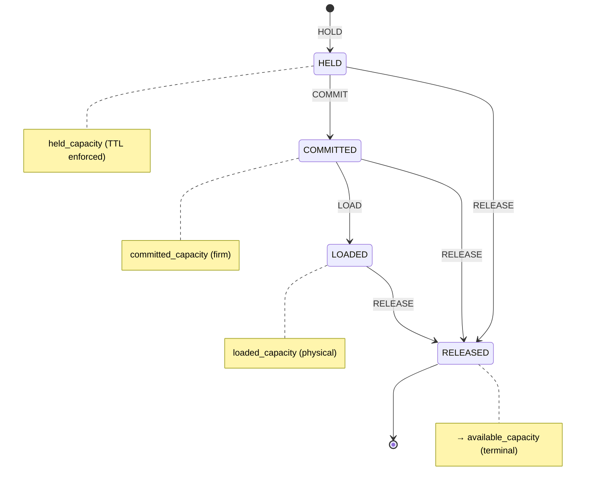
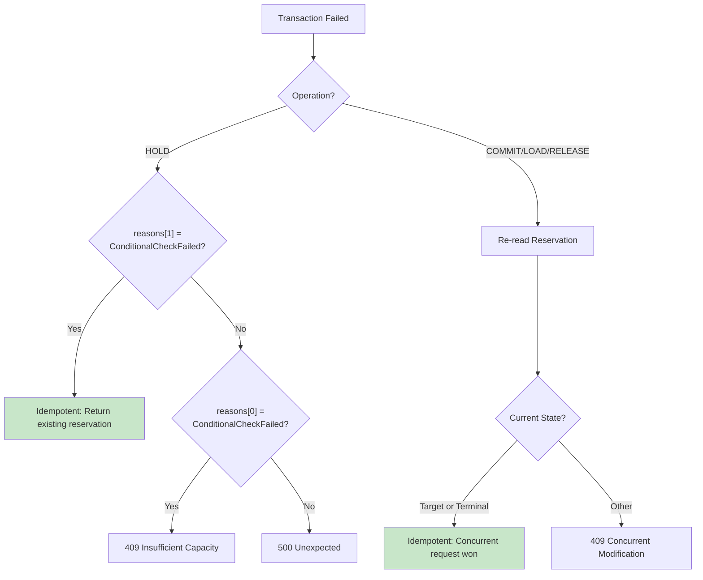
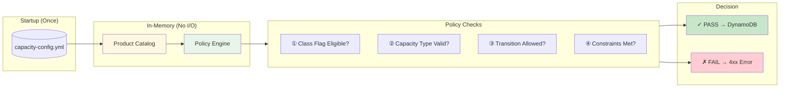

# StockKeeper API Flow Diagrams

This document provides Mermaid flow diagrams documenting API operations, validation, state transitions, and DynamoDB mutations.

---

## Architecture Context

### AWS Infrastructure & Disaster Recovery

The StockKeeper system is deployed in an **active–passive multi-region AWS architecture**. For the complete infrastructure topology, disaster recovery strategy, and regional failover design, refer to the AWS Architecture Diagram below.

#### Deployment Topology Summary

| Aspect | Primary Region (Active) | Secondary Region (Passive) |
|--------|-------------------------|----------------------------|
| **Traffic** | All read/write operations | No traffic until failover |
| **EKS Services** | Fully scaled, processing requests | Cold standby (scaled to 0) |
| **DynamoDB** | Global Tables (active writes) | Global Tables (read-only replica) |
| **Failover** | — | Promoted via Route 53 health checks |

#### Separation of Concerns

| Diagram Type | Scope | Covers |
|--------------|-------|--------|
| **AWS Architecture Diagram** | Infrastructure layer | Regions, VPCs, EKS, DynamoDB Global Tables, Route 53, DR strategy, failover |
| **Mermaid Flow Diagrams** (this document) | Application layer | API operations, validation logic, state transitions, Policy Engine, DynamoDB mutations |

---

## 1. System Architecture Overview

**All product catalog data and policy rules are loaded into memory at startup; no runtime network calls are made to external services for validation or policy decisions.**

> **Key Insight:** Product rules and policy are enforced in memory before any DynamoDB write. DynamoDB is used only for state persistence, quantity mutations, and idempotency checks.

---

## 2. HOLD Operation Flow

The HOLD operation creates a new reservation. It's the only operation that creates a reservation record; all others transition existing reservations.

### Key Generation Pattern

| Input Field | Generated Key |
|-------------|---------------|
| flightId + departureDate | `stockPk = FLIGHT#<flightId>#<departureDate>` |
| departureDatetime | `stockSk = WINDOW#<departureDatetime>` |
| shipmentId + capacityType + stockPk + stockSk | `reservationId = RESV#<shipmentId>#<capacityType>#<pk>#<sk>` |

---

## 3. State Transition Operations (COMMIT / LOAD / RELEASE)

All transition operations follow the same pattern: read reservation → validate transition → atomic update. The only differences are the source/target states and capacity buckets.

### Operation-Specific Details

| Operation | Valid From | Target State | Capacity Movement |
|-----------|------------|--------------|-------------------|
| **COMMIT** | HELD | COMMITTED | held → committed |
| **LOAD** | COMMITTED | LOADED | committed → loaded |
| **RELEASE** | HELD, COMMITTED, LOADED | RELEASED | any → available |

### DynamoDB Condition Expressions

| Operation | Stock Condition | Reservation Condition |
|-----------|-----------------|----------------------|
| HOLD | `available_capacity >= :qty` | `attribute_not_exists(reservation_id)` |
| COMMIT | `held_capacity >= :qty` | `status = 'HELD'` |
| LOAD | `committed_capacity >= :qty` | `status = 'COMMITTED'` |
| RELEASE | `<source>_capacity >= :qty` | `status = :currentStatus` |

---

## 4. State Machine & Transitions

| From State | To States | Capacity Bucket |
|------------|-----------|-----------------|
| — | HELD | held_capacity |
| HELD | COMMITTED, RELEASED | → committed or → available |
| COMMITTED | LOADED, RELEASED | → loaded or → available |
| LOADED | RELEASED | → available |
| RELEASED | (terminal) | — |

---

## 5. Idempotency Handling

All operations are idempotent through deterministic keys and conditional writes.

### Idempotency Strategy

| Mechanism | How It Works |
|-----------|--------------|
| **Deterministic Keys** | Same business fields → same reservationId (no random UUIDs) |
| **Conditional Writes** | HOLD: `attribute_not_exists`, Transitions: `status = expected` |
| **Read-After-Conflict** | On failure, re-read; if target state reached → idempotent success |

---

## 6. Product Catalog & Policy Engine

The Product Catalog is loaded from `capacity-config.yml` at startup and kept **in memory**. The Policy Engine enforces all business rules **before** any DynamoDB operation.

### Product Categories (from capacity-config.yml)

| Capacity Type | Allowed Class Flags | Unit | Max Hold |
|---------------|---------------------|------|----------|
| FLIGHT | GENERAL, PRIORITY, EXPRESS, DANGEROUS_GOODS | KG | 60 min |
| WAREHOUSE | GENERAL, COLD_STORAGE, HAZMAT, OVERSIZED | CBM | 120 min |
| ULD | GENERAL, PRIORITY, TEMPERATURE_CONTROLLED | KG | 90 min |

### Policy Engine Guarantees

- **Deterministic** — Purely config-driven, no AI/ML
- **No Network I/O** — All checks in application memory
- **Fail Fast** — Invalid requests rejected before DynamoDB
- **Single Source of Truth** — All rules from `capacity-config.yml`

---

## Quick Reference

### API Endpoints

| Endpoint | Method | Description |
|----------|--------|-------------|
| `/stocks/hold` | POST | Reserve capacity (→ HELD) |
| `/stocks/commit` | POST | Confirm reservation (→ COMMITTED) |
| `/stocks/load` | POST | Mark as loaded (→ LOADED) |
| `/stocks/release` | POST | Release reservation (→ RELEASED) |
| `/stocks` | GET | List/query stock items |
| `/stocks/{pk}/{sk}` | GET | Get single stock item |

### HTTP Response Codes

| Code | Meaning |
|------|---------|
| 200 | Success (check `isIdempotent` flag) |
| 400 | Validation error / Policy violation |
| 404 | Stock or reservation not found |
| 409 | Insufficient capacity or concurrent modification |
| 422 | Invalid state transition |
